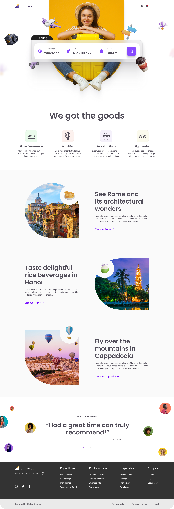

# A travel business landing page made with **bootstrap 5.3v**

> This is a landing page made with latest version for bootstrap you can clone it and play around with it.

-Boostrap v5
-travelling business landing page with demo link attached

<picture>
  <source media="(prefers-color-scheme: dark)" srcset="./images/bootstrap-travell-business-landing-page.png">
  <source media="(prefers-color-scheme: light)" srcset="./images/bootstrap-travell-business-landing-page.png">
  
</picture>

&nbsp;
# Steps to follow for running this project on your localhost.

1. clone the repository in your system.
   `git clone https://github.com/rohit-saluja/business-landing-page-bootstrap.git`
2. `cd business-landing-page-boostrap`
3. install five-server to vs code
4. then press go live after opening the code folder to the vs code.
5. make the changes to the code it will reflect to the localhost

# For recreating this landing page for practise purpose follow this link below:

This is the link for the design [Figma link](https://www.figma.com/file/1nayvEhzAOiMxeIy6RlqDB/Travel-Landing-Page-(Community)?node-id=1%3A2&t=rxGfXwPzwpabmeU0-1)
